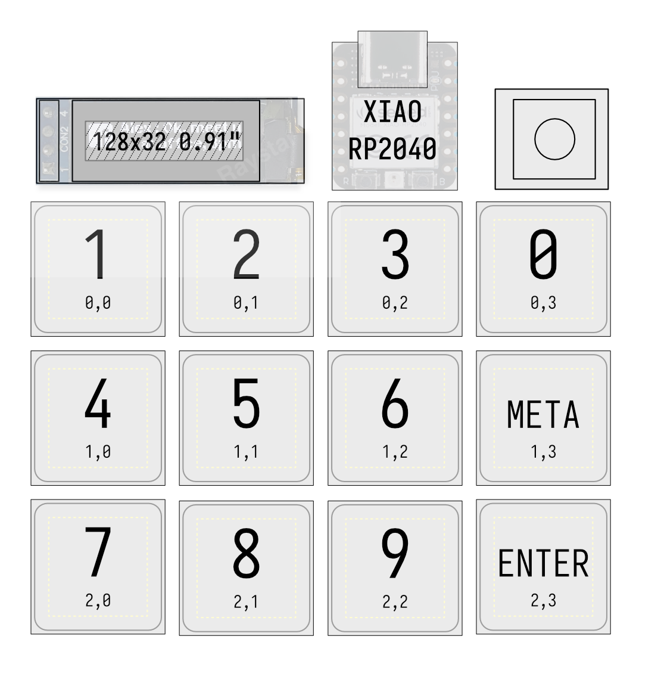

# Hackpad submission

My Hackpad for comms (comunication) with a rotary encoder for volume, 12 keys and a screen (It took me long because im sick and i cant think ) 

Details TBD
# Firmware
The firmware is going to be written in rust and will run on a p2p infrastructure with a daemon on the target pc allowing for more advanced macros