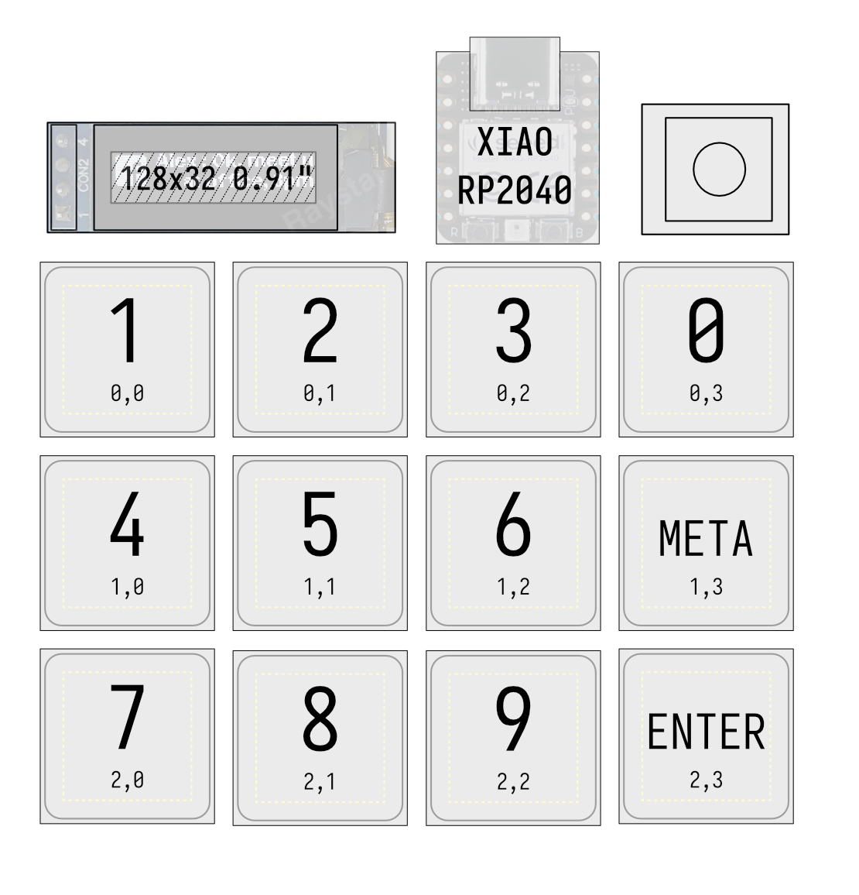
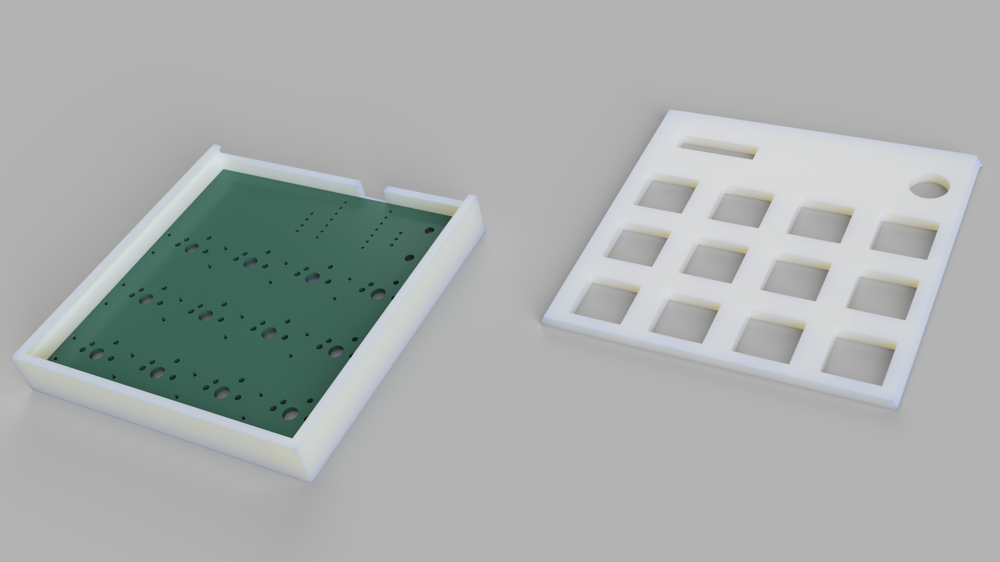
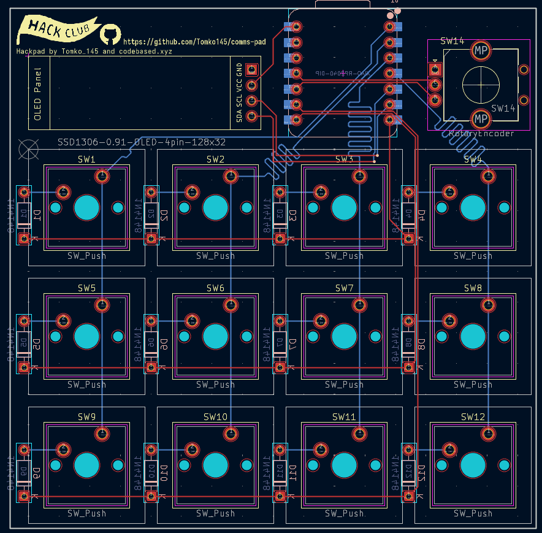
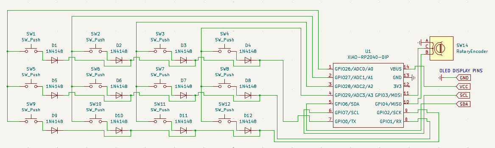

# Hackpad submission
## Graphics
### Layout schematic

### Fusion360 case render with pcb inside

### Kicad PCB design

### Kicad Electrical schematic

My Hackpad for comms (comunication) with a rotary encoder for volume, 12 keys and a screen (It took me long because im sick and i cant think ) 

Details TBD
# Firmware
## Prototype firmware
For now written in Python with QMK for basic HID functionality. It does not include any screen functionality.
## Final firmware
The firmware is going to be written in rust (to maximise resource control allowing for more complexity) and will run on a p2p infrastructure with a daemon on the target pc allowing for more advanced macros. The complexity is too big to write without the microcontroller available